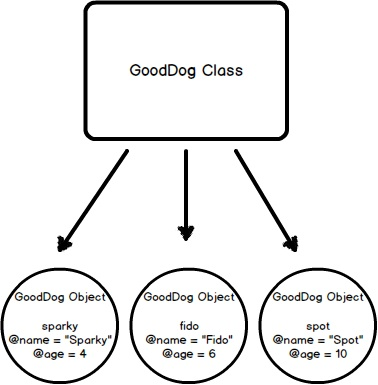

# OOP Book Notes #

- [The Object Model](#the-object-model)
  - [Classes Define Objects](#classes-define-objects)
  - [Modules](#modules)
  - [Method Lookup](#method-lookup)
  - [Exercises](#exercises-1)
- [Classes and Objects - Part I](#classes-and-objects-i)
  - [States and Behaviors](#states-and-behaviors)
  - [Initializing a New Object](#initializing-a-new-object)
  - [Instance Variables](#instance-variables)
  - [Instance Methods](#instance-methods)
  - [Accessor Methods](#accessor-methods)
  - [Exercises](#exercises-2)
- [Classes and Objects - Part II](#classes-and-objects-ii)
  - [Class Methods](#class-methods)
  - [Class Variables](#class-variables)
  - [Constants](#constants)
  - [The to_s Method](#the-tos-method)
  - [More About self](#more-about-self)
  - [Exercises](#exercises-3)
- [Inheritance](#inheritance)
  - [Class Inheritance](#class-inheritance)
  - [super](#super)
  - [Mixing in Modules](#mixing-in-modules)
  - [Inheritance vs Modules](#inheritance-vs-modules)
  - [Method Lookup Path](#method-lookup-path)
  - [More Modules](#more-modules)
  - [Private, Protected, and Public](#private-protected-and-public)
  - [Accidental Method Overriding](#accidental-method-overriding)
  - [Exercises](#exercises-4)


## The Object Model ##

### Classes Define Objects ###

*classes*
: the attributes and behaviors of its objects

Classes are basic outlinbes of what an object should be made of and what it should be able to do.

Defining a class has syntax similar to defining a method. We replace the `def` with `class` and use the CamelCase naming convention to create the name. We then use the reserved word `end` to finish the definition. Ruby file names should be `snake_case`, and reflect the class name.

```ruby
# good_dog.rb
class GoodDog
end

sparky = GoodDog.new
```
In the above example, we created an instance of our `GoodDog` class and stored it in the variable `sparky`. We cna now say that `sparky` is an object or instance of class `GoodDog`. This entire workflow of creating a new object or instance from a class is called **instantiation**, so we can also say that we've instantiated an object called `sparky` from the class `GoodDog`

A visual for what we're doing...


### Modules ###

Modules are another way to achieve polymorphism in Ruby.

*module*
: a collection of behaviors that are usable in other classes via **mixins**

A module is "mixed in" to a class using the `include` method invocation. If we wanted `GoodDog` to have a `speak` method but also other classes could use the speak method as well, here's what we would do...

```ruby
#good_dog.rb
module Speak
  def speak(sound)
    puts sound
  end
end

class GoodDog
  include Speak
end

class HumanBeing
  include Speak
end

sparky = GoodDog.new
sparky.speak("Arf!")   # => Arf!
bob = HumanBeing.new
bob.speak("Hello!")    # => Hello!
```

Both the `GoodDog` object and `HumanBeing` object both have access to the `speak` instance method through "mixing in" the module `Speak`. It's as if we copy-pasted the `speak` method into the `GoodDog` and `HumanBeing` classes.

### Method Lookup ###

Ruby has a distinct loopup path that it follows each time a method is called. If we use the program from above to see what the method lookup path is for our `GoodDog` class, we can use the `ancestors` method on any class to find out that method lookup chain.

```ruby
#good_dog.rb
module Speak
  def speak(sound)
    puts "#{sound}"
  end
end

class GoodDog
  include Speak
end

class HumanBeing
  include Speak
end

puts "---GoodDog ancestors---"
puts GoodDog.ancestors
puts ''
puts "HumanBeing ancestors---"
puts HumanBeing.ancestors
```

Output of the above code would be...

```ruby
---GoodDog ancestors---
GoodDog
Speak
Object
Kernel
BasicObject

---HumanBeing ancestors---
HumanBeing
Speak
Object
Kernel
BasicObject
```

The `Speak` module is right between out custom classes and the `Object` class that comes with Ruby.

This means that since the `speak` method is not defined in the `GoodDog` class, the next place it looks is in the `Speak` module. This conintues in an ordered, linear fashion, until the method is either found, or there aren't any more places to look.

### Exercises 1 ###

1. How do we create an object in Ruby? Give an example of the creation of an object.

> We create an object by defining a class and instantiating it by using the `.new` method to create an instance, also known as an object.

```ruby
class Creation
end

the_world = Creation.new
```

2. What is a module? What is its purpose? How do we use them with our classes? Create a module for the clsas you created in exercise 1 and include it properly

> A module is a collection of behaviors that are usable in other classes via **mixins**. It allows us to use behaviors that can be used by multiple differenct classes. Any class could have access to the trees instance method if they mixed-in Foliage through the `include` method within their class definition

```ruby
module Foliage
  def trees
    puts "We planted a tree!"
  end
end

class Creation
  include Foliage
end

the_world = Creation.new
the_world.trees
```

## Classes and Objects I ## 

### States and Behaviors ###

We use classes to create objects. When defining a class, we typically focus on two things: *states* and *behaviors*.

*states*
:track attributes for individual objects

*behaviors*
:exactly what objects are capable of doing

Instance variable keep track of state, and instance methods expose behavior for objects.

### Initiailizing a New Object ###

Using the `GoodDog` class from before, let's add an `initialize` method that will be called everytime a new object is created from the `GoodDog` class.

```ruby
class GoodDog
  def initialize
    puts "This object was initialized!"
  end
end

sparky = GoodDog.new      # => "This object was initialized!"
```

We call the `new` method when we create an object, and that eventually leads us to the `initialize` method. In this example above, initializating a new `GoodDog` object triggered the `initialize` method and resulted from the string being outputted. We refer to the `initialize` method as a *constructor*, because it gets triggered whenever we create a new object.

### Instance Variables ###

Let's now create a new object and instantiate it with some state, like a name.

```ruby
class GoodDog
  def initialize(name)
    @name = name
  end
end
```

We have just used an **instance variable** for `@name`

**instance variable**
: a variable that exists as long as the object instance exists. It is one of the ways we tie data to objects.

It does does not "die" after the initialize method is run, but rather it "lives on", to be referenced, until the object instance is destroyed.

In the example above, our `initialize` method take a parameter called `name`. You can pass arguments into the `initialize` method throgh the `new` method.

```ruby
sparky = GoodDog.new("Sparky")
```

Here, the string "Sparky" is being passed from the `new` method through the `initialize` method and is assigned to the local variable `name`. Within the constructor (i.e., the `initialize` method), we then set teh instance variable `@name` to `name`, which results in assigning the string "Sparky" to the `@name` instance variable.

Instance variable are responsible for keeping track of information about the *state* of an object. Above, the name of the `sparky` object is the string "Sparky". This state for the object is tracked in the instance variable, `@name`. We could create another `GoodDog` object with `fido = GoodDog.new('Fido')`, then the `@name` instance variable for the fido object would contain the string "Fido"

Every object's state is unique, and instance variables are how we keep track.

### Instance Methods ###

```ruby 
class GoodDog
  def initialize(name)
    @name = name
  end
  
  def speak
    "Arf!"
  end
end

sparky = GoodDog.new("Sparky")
puts sparky.speak           # => Arf!

fido = GoodDog.new("Fido")
puts fido.speak             # => Arf!
```

Each of these objects perform the same `GoodDog` behaviors. All objects of the same class have the same behaviors, though they contain different states; here, the differing state is the name.

If we wanted to say "Sparky says arf!", then in our instance method(which are what all methods are so far), we have to access our instance variable. We can use string interpolation to accomplish this...

```ruby
def speak
  "#{@name} says arf!"
end

puts sparky.speak           # => "Sparky says arf!"
puts fido.speak             # => "Fido says arf!"
```

### Accessor Methods ###

If we wanted to access the name of an object, we would need to create a method that will return the name, which is stored in the `@name` instance variable

```ruby
class GoodDog
  def initialize(name)
    @name = name
  end

  def get_name
    @name
  end

  def speak
    "#{@name} says arf!"
  end
end

sparky = GoodDog.new("Sparky")
puts sparky.speak
puts spark.get_name

# Output =>
# Sparky says arf!
# Sparky
```

This demonstates a *getter* method. If we wanted to change `sparky's` name, we would need a *setter* method.

```ruby
class GoodDog
  def initialize(name)
    @name = name
  end

  def get_name
    @name
  end

  def set_name=(name)
    @name = name
  end

  def speak
    "#{@name} says arf!"
  end
end

sparky = GoodDog.new("Sparky")
puts sparky.speak
puts sparky.get_name
sparky.set_name = "Spartacus"
puts sparky.get_name

# Output
# Sparky says arf!
# Sparky
# Spartacus
```

*setter* method `set_name=` above is special syntax from Ruby.

To use the `set_name=` method normally, we would actuall write `sparky.set_name=("Spartacus")`, where the entire "set_name=" is the method name, and the string "Spartacus" is the argument being passed in to the method. Ruby recognizes that this is a *setter* method and allows us to sue the more natural syntax of `sparky.set_name = "Spartacus"`. This is more of Ruby's syntactical sugar.

Typically, Rubyists want to name the *getter* and *setter* methods with the same name as the instance variable they are exposing and setting.

```ruby
class GoodDog
  def initialize(name)
    @name = name
  end

  def name                  # This was renamed from "get_name"
    @name
  end

  def name=(n)              # This was renamed from "set_name="
    @name = n
  end

  def speak
    "#{@name} says arf!"
  end
end

sparky = GoodDog.new("Sparky")
puts sparky.speak
puts sparky.name            # => "Sparky"
sparky.name = "Spartacus"
puts sparky.name            # => "Spartacus"
```

*Setter* methods will always return the value that is passed in as an argument, regardless of what happens inside of the method. It'll just ignore the code.

```ruby 
class Dog
  def name=(n)
    @name = n   
    "Laddieboy"   ##<= value will be ignored
  end
end

sparky = Dog.new()
puts(sparky.name = "Sparky")   # returns "Sparky"
```

That code is pretty long and if we wanted to also track height or weight, it would be even longer. Ruby has a built-in way to automatically create these *setter* and *getter* methods using the **att_accessor** method.

```ruby
class GoodDog
  attr_accessor :name

  def initialize(name)
    @name = name
  end

  def speak
    "#{@name} says arf!"
  end
end

sparky = GoodDog.new("Sparky")
puts sparky.speak
puts sparky.name            # => "Sparky"
sparky.name = "Spartacus"
puts sparky.name            # => "Spartacus"
```

The `attr_accessor` method takes a symbol as an argument, which it uses to create the method name for the `getter` and `setter` methods. This one line replaced two method definitions.

If you want the `getter` method only, use `attr_reader`. This works the same way but only allows you to retrieve the instance variable.

If you only want the `setter` method, use the `attr_writer` method.

All of the `attr_*` methods take a `Symbol` as parameters, and if you wanted to track more states, use:

```ruby
attr_accessor :name, :height, :weight
```

#### Accessor Methods in Action ####

```ruby
def speak
  "#{@name} says arf!"
end
```

Instead of using the instance variable `@name`, we can use the getter method like below.

```ruby
def speak
  "#{name} says arf!"
end
```

This now calls the instance method instead of the instance variable. Why make this change? It's generally a good idea to call the *getter* method instead of referencing the instance variable.

Suppose we're keeping track of social security numbers in an instance variable called @ssn. And suppose that we don't want to expose the raw data, i.e. the entire social security number, in our application. Whenever we retrieve it, we want to only display the last 4 digits and mask the rest, like this: "xxx-xx-1234". If we were referencing the @ssn instance variable directly, we'd need to sprinkle our entire class with code like this:

```ruby
# converts '123-45-6789' to 'xxx-xx-6789'
'xxx-xx-' + @ssn.split('-').last
```

But if we wanted to change the format or if there's a bug, t's much easier to just reference a getter method and make changes in one place.

```ruby
def ssn
  #converts '123-45-6789' to xxx-xx-6789'
  'xxx-xx-' + @ssn.split('-').last
end
```

Now we can use the `ssn` instance method throughout our class to retrieve the social security number.

If we added two more states to track to the `GoodDog` class called "height" and "weight":
```ruby
attr_accessor :name, :height, :weight
```
This one line of code gives us six getter/setter instance methods: `name`, `name=`, `height`, `height=`, `weight`, `weight=`. It also gives us three instance variables: `@name`, `@height`, and `@weight`. Now we can create a new method that allows us to change several states at once called `change_info(n, h, w)`. Implem`ented below

```ruby
def change_info(n, h, w)
  @name `= n
  @height = h
  @weight = w
end
```

To get caught up with out `GoodDog` class

```ruby
class GoodDog
  attr_accessor :name, :height, :weight

  def initialize(n, h, w)
    @name = n
    @height = h
    @weight = w
  end

  def speak
    "#{name} say arf!"
  end

  def change_info(n, h, w)
    @nam`e = n
    @height = h
    @weight = w
  end

  def info
    "#{name} weighs #{weight} and is #{height} tall."
  end
end
```

Use the `change_info` method like this`:
```ruby
sparky = GoodDog.new('Sparky', '12 inches', '10 lbs')
puts sparky.info      # => Sparky weighs 10 lbs and is 12 inches tall.

sparky.change_info('Spartacus', '24 `inches', '45 lbs')
puts sparky.info      # => Spartacus weighs 45 lbs and is 24 inches tall.
```

Just like when we replaced accessing the instance variable directly, we'd want to do the same with out setter method.

```ruby
def change_info(n, h, w)
  name =` n
  height = h
  weight = w
end
```

This didn't change sparky's information though...

#### Calling Methods With self ####

Ruby thought we were initializing local variables. It turns out that instead of calling the setter methods `name=`, `weight=`, or `height=`, we actually created three new local variables, which isn't what we wanted.

To disambiguate from creating a local variable, we need to use `self.name=` to let Ruby know that we're calling a method. `change_info should be updated` to 
```ruby
def change_info(n, h, w)
  self.name = n
  self.height = h
  self.weight = w
end
```
This tells Ruby that we're calling a setter method, not creating a local variable. For consistency, adopt this syntax for the getter methods as well
```ruby
def info
  "#{self.name} weighs #{self.weight} and is #{self.height} tall."
end
```

> Note that prefixing `self`. is not restricted to just the accessor methods; you can use it with any instance method. For example, the `info` method is not a method given to us by `attr_accessor`, but we can still call it using `self.info`:

```ruby
class GoodDog
  # ... rest of code omitted for brevity
  def some_method
    self.info
  end
end
```

### Exercises 2 ###

```ruby
=begin
1. 
  - Create a class called MyCar. 
  - When you initialize a new instance or object of the class, allow the user 
  to define some instance variables that tell us the year, color, and model of the car. 
  - Create an instance variable that is set to 0 during instantiation of the  
  object to track the current speed of the car as well. 
  - Create instance methods that allow the car to speed up, brake, and shut the car off.
2.
  - Add an accessor method to your MyCar class to change and view the color of your car. 
  - Add an accessor method that allows you to view, but not modify, the year of your car.
3.
  - Create a method called spray_paint that can be called on an object and will 
  modify the color of the car.
=end

class MyCar
  attr_accessor :color, :model, :current_speed
  attr_reader :year

  def initialize(y, c, m)
    @year = y
    @color = c 
    @model = m 
    @current_speed = 0
  end

  def spray_paint(color)
    self.color = color
    "Your new #{color} paint job looks great!"
  end

  def info
    "Your car is a #{self.color} #{self.year} #{self.model}"
  end

  def speed_up(mph)
    self.current_speed += mph
    "You accelerate #{mph} mph."
  end

  def brake(mph)
    self.current_speed -= mph
    "You brake and decelerate #{mph} mph."
  end

  def turn_off
    self.current_speed = 0
    "You have just turned off your car."
  end

  def current
    "You are now going #{self.current_speed} mph"
  end
end

armada = MyCar.new(2019, 'Silver', 'Nissan Armada')

puts '---ex 1---'
puts armada.speed_up(75)
puts armada.current
puts armada.speed_up(10)
puts armada.current
puts armada.brake(55)
puts armada.current
puts armada.brake(20)
puts armada.current
puts armada.turn_off
puts armada.current
puts '---ex2---'
puts armada.info
puts armada.spray_paint('Black')
puts armada.info

# Output
# ---ex 1---
# You accelerate 75 mph.
# You are now going 75 mph
# You accelerate 10 mph.
# You are now going 85 mph
# You brake and decelerate 55 mph.
# You are now going 30 mph
# You brake and decelerate 20 mph.
# You are now going 10 mph
# You have just turned off your car.
# You are now going 0 mph
# ---ex2---
# Your car is a Silver 2019 Nissan Armada
# Your new Black paint job looks great!
# Your car is a Black 2019 Nissan Armada
```

## Classes and Objects II ## 

### Class Methods ###

**class methods**
: methods we can call directly on the class itself, without having to instantiate any objects.

When defining a class method, prepend the method name with the reserved word `self.`
```ruby
# ... rest of code ommitted for brevity

def self.what_am_i         # Class method definition
  "I'm a GoodDog class!"
end
```

We can then call the class method by using the class name followed by the method name without having to instantiate any objects.
```ruby
GoodDog.what_am_i          # => I'm a GoodDog class!
```

Why? Class methods are where we can put functionality that does not pertain to individual objects.  Objects contain state, and if we have a method that does not need to deal with states, then we can just use a class method, like the simple example above.

### Class Variables ###

**class variables**
: variables that capture information related to the entire class, created using two `@` symbols: `@@`

```ruby
class GoodDog
  @@number_of_dogs = 0

  def initialize
    @@number_of_dogs += 1
  end

  def self.total_number_of_dogs
    @@number_of_dogs
  end
end

puts GoodDog.total_number_of_dogs   # => 0

dog1 = GoodDog.new
dog2 = GoodDog.new

puts GoodDog.total_number_of_dogs   # => 2
```

This is an example of using a clas variable and a class method to keep track of a class level detail that pertains only to the class, and not to individual objects

### Constants ###

**constants**
: technically defined by using a single uppercase letter at the beginning of the variable name, but most Rubyists will make the entire variable uppercase

```ruby
class GoodDog
  DOG_YEARS = 7

  attr_accessor :name, :age

  def initialize(n, a)
    self.name = n
    self.age  = a * DOG_YEARS
  end
end

sparky = GoodDog.new("Sparky", 4)
puts sparky.age             # => 28
```

It is possible to reassign a new value to constants but Ruby will throw a warning

### The to_s Method ###

`to_s` instance method comes built in to every class in Ruby.

Using the code above, if we ran `puts sparky` it returns `#<GoodDog:0x007fe542323320>`.
What happends is that the puts method automatically calls `to_s` on its argument, which is the `sparky` object.

Basically, `puts sparky` is equivalent to `puts sparky.to_s`

By defalut, `to_s` method returns the name of the object's class and an encoding of the object id.

>Note: `puts` method calls `to_s` for any argument that is not an array. For an array, it writes on separate lines the result of calling `to_s` on each element of the array.

```ruby
class GoodDog
  DOG_YEARS = 7

  attr_accessor :name, :age

  def initialize(n, a)
    @name = n
    @age  = a * DOG_YEARS
  end

  def to_s
    "This dog's name is #{name} and it is #{age} in dog years."
  end
end

puts sparky      # => This dog's name is Sparky and is 28 in dog years.
```

We overrode the `to_s` instance method

`p` method is similar to `puts` but calls `inspect` instead of object id. `inspect` is very helpful for debugging purposes, so we don't want to override it.

```ruby
p sparky         # => #<GoodDog:0x007fe54229b358 @name="Sparky", @age=28>
```

Another important attribute of the `to_s` method is that it's automatically called in string interpolation

### More About self ###

So far, we have two clear uses for `self`:
  1. Use `self` when calling setter methods from within the class. This was necessary in order for the `change_info` method to work p`roperly. We used it for Ruby to disambiguate between initializing a local variable and calling a setter method.
  2. Use `self` for class method definitions

```ruby
class GoodDog
  attr_accessor :name, :height, :weight

  def initialize(n, h, w)
    self.name   = n
    self.height = h
    self.weight = w
  end

  def change_info(n, h, w)
    self.name   = n
    self.height = h
    self.weight = w
  end

  def info
    "#{self.name} weighs #{self.weight} and is #{self.height} tall."
  end

  def what_is_self
    self
  end
end

sparky = GoodDog.new('Sparky', '12 inches', '10 lbs')
p sparky.what_is_self
# => #<GoodDog:0x007f83ac062b38 @name="Sparky", @height="12 inches", @weight="10 lbs">
```

From within the class, when an instance method uses `self`, it references the *calling object*. In the example above, that's the `sparky` object. Therefore, from within the `change_info` method, calling `self.name=` acts the same as calling `sparky.name=` from *outside* the class (you can't call `sparky.name=` inside the class, though, since it isn't in scope)

Putting `self` inside a class but outside an instance method refers to the class itself. A method prefixed with self is the same as defining teh method on the class.

To be clear, from within a class...

  1. `self`, inside of an instance method, references the instance (object) that called the method - the calling object. Therefore, `self.weight=` is the same as `sparky.weight=`, in our example.

  2. `self`, outside of an instance method, references the class and can be used to define class methods. Therefore if we were to define a `name` class method, `def self.name=(n)` is the same as `def GoodDog.name=(n)`.

Self is a way of being explicit about what our program is referencing and what our intentions are as far as behavior. `self` changes depending on the scope it is used in, so pay attention to see if you're inside an instance method or not.

### Exercises 3 ###

```ruby
#exs_3_1-2.rb
=begin
1. Add a class method to MyCar that calculates the gas mileage of any car
2. Override the to_s method to create a user friendly printout of an instance
=end

class MyCar
  attr_accessor :color, :model, :current_speed
  attr_reader :year

  def initialize(y, c, m)
    @year = y
    @color = c 
    @model = m 
    @current_speed = 0
  end

  def spray_paint(color)
    self.color = color
    "Your new #{color} paint job looks great!"
  end

  def to_s
    "Your car is a #{self.color}, #{self.year} #{self.model}"
  end

  def speed_up(mph)
    self.current_speed += mph
    "You accelerate #{mph} mph."
  end

  def brake(mph)
    self.current_speed -= mph
    "You brake and decelerate #{mph} mph."
  end

  def turn_off
    self.current_speed = 0
    "You have just turned off your car."
  end

  def current
    "You are now going #{self.current_speed} mph"
  end
  # use a class method because no matter what car you have, gas mileage is
  # calculated the same way
  def self.gas_mileage(gas, mileage)
    "You are getting #{mileage / gas} miles to the gallon of gas"
  end
end

armada = MyCar.new(2019, 'Silver', 'Nissan Armada')
whitey = MyCar.new(2016, 'White', 'Toyota Tundra')

puts armada
puts MyCar.gas_mileage(19, 240)
puts "#{whitey}"
puts MyCar.gas_mileage(24, 330)

# 3. When we run the following code...

class Person
  attr_reader :name
  def initialize(name)
    @name = name
  end
end

bob = Person.new("Steve")
bob.name = "Bob"

#  We get the following error...
# test.rb:9:in `<main>': undefined method `name=' for
  #<Person:0x007fef41838a28 @name="Steve"> (NoMethodError)

#  Why and how do we fix it?
=begin
The class definition is solid. We create a new instance(object)
of bob and its name attribute is assigned to "Steve".

When we go to reassign that name attribute, we run into the error.
This is because the name instance variable is set to a 'getter' method.
We can fix it by changing line 4 to `attr_writer` (setter method) or 
`attr_accessor` (both getter and setter method) and the code will run.
=end
```

## Inheritance ##

**Inheritance**
: when a class **inherit** behavior from another class. The class that is inheriting behavior is call the subclass and the class it inherits from is called the superclass.

### Class Inheritance ###

We can extrract the `speak` method to a superclass `animal` and use inheritance to make that behavior available to `GoodDog` and `Cat` classes.

```ruby
class Animal
  def speak
    "Hello!"
  end
end

# the `<` symbol signifies that the GoodDog class is inheriting from the Animal class. All methods of Animal class are available to GoodDog.
class GoodDog < Animal
end
# Same goes for Cat class
class Cat < Animal
end

sparky = GoodDog.new
paws = Cat.new
puts sparky.speak           # => Hello!
puts paws.speak             # => Hello!
```

If instead we added the speak method back to `GoodDog`, then Ruby will first check the object's class first for the method before it looks to the superclass. This is called **overriding**.

Inheritance can be a great way to remove duplication in your code base. The acronym to follow in the Ruby community is "DRY" -- "Don't Repeat Yourself!"

If you find yourself reusing the same logic over and over again, there are ways to extract that logic in one place for reuse.

### super ###

```ruby
class Animal
  def speak
    "Hello!"
  end
end

class GoodDog < Animal
  def speak
  # We call super from within a method and the lookup path will search for a method of the same name and invoke it
    super + " from GoodDog class"
  end
end

sparky = GoodDog.new
puts sparky.speak        # => "Hello! from GoodDog class"
```
In `GoodDog`, we override the speak method from the superclass, but we use `super` to invoke the `speak` method from the superclass and extend the funtionality by appending some text to the return value.

A more common way of using `super` is with `initialize`
```ruby
class Animal
  attr_accessor :name

  def initialize(name)
    @name = name
  end
end

class GoodDog < Animal
  def initialize(color)
    super
    @color = color
  end
end

bruno = GoodDog.new("brown")        # => #<GoodDog:0x007fb40b1e6718 @color="brown", @name="brown">
```
What's interesting above is that we call `super` without any arguments; however, since we see brown assigneds to name and color for GoodDog, `super` automatically forwards the arguments that were passed to the method from with `super` is called. 

If super is called with specific arguments, the specified arguments will be sent up the method lookup chain.

```ruby
class BadDog < Animal
  def initialize(age, name)
    super(name)
    @age = age
  end
end

BadDog.new(2, "bear")        # => #<BadDog:0x007fb40b2beb68 @age=2, @name="bear">
```
If you call `super()` exactly as shown -- with parentheses -- it calls the method in the superclass with no arguments at all.
```ruby
class Animal
  def initialize
  end
end

class Bear < Animal
  def initialize(color)
    super()
    @color = color
  end
end

bear = Bear.new("black")        # => #<Bear:0x007fb40b1e6718 @color="black">
```

### Mixing in Modules ###

The goal is to put the right behavior (i.e. methods) in the right class so we don't need ot repeat code in multiple classes.

```ruby
module Swimmable
  def swim
    "I'm swimming!"
  end
end

class Animal; end

class Fish < Animal
  include Swimmable         # mixing in Swimmable module
end

class Mammal < Animal
end

class Cat < Mammal
end

class Dog < Mammal
  include Swimmable         # mixing in Swimmable module
end

# Now Fish and Dog objects can swim, but obejects of other classes cannot
sparky = Dog.new
neemo  = Fish.new
paws   = Cat.new

sparky.swim                 # => I'm swimming!
neemo.swim                  # => I'm swimming!
paws.swim                   # => NoMethodError: undefined method `swim' for #<Cat:0x007fc453152308>
```

>Note: A common naming convention for Ruby is to use the "able" suffix on whatever verb describes the behavior that the module is modeling. You can see this convention with our Swimmable module. Likewise, we could name a module that describes "walking" as Walkable. Not all modules are named in this manner, however, it is quite common.

### Inheritance vs Modules ###

**interface inheritance**
: where mixin modules come into play. The class doesn't inherit from another type, but instead inherits the interface provided by the mixin module.

When to use class inheritance vs mixins:
  - You can only subclass (class inheritance) from one class. You can mix in as many modules (interface inheritance) as you'd like.
  - If there's an "is-a" relationship, class inheritance is usually the correct choice. If there's a "has-a" relationship, interface inheritance is generally a better choice. For example, a dog "is an" animal and it "has an" ability to swim.
  -You cannot instantiate modules (i.e., no object can be created from a module). Modules are used only for namespacing and grouping common methods together

### Method Lookup Path ###

```ruby
module Walkable
  def walk
    "I'm walking"
  end
end

module Swimmable
  def swim
    "I'm swimming"
  end
end

module Climbable
  def climb
    "I'm climbing"
  end
end

class Animal
  include Walkable

  def speak
    "I'm an animal, and I speak"
  end
end

class GoodDog < Animal
  include Swimmable
  include Climbable
end

# See the method lookup path with the ancestors class method
puts '---Animal Method Lookup---'
puts Animal.ancestors
  # -> ---Animal method lookup---
  # -> Animal (Ruby looks for the method here first)
  # -> Walkable
  # -> Object
  # -> Kernel
  # -> BasicObject

fido = Animal.new
puts fido.speak
  # -> I'm an animal, and I speak
  # the speak method is found in the Animal class, then Ruby stops looking

puts fido.walk
  # -> I'm walking
  # Ruby checks Animal for a walk method, doesn't find one
  # next it checks the walkable module, finds walk method, stops looking

# puts fido.swim
  # -> NoMethodError: undefined method 'swim' for #<Animal:0x...etc
  # The Swimmable module is not mixed in to Animal so is not available to fido

# The order in which we include modules in a class is important
puts "---GoodDog Method Lookup---"
puts GoodDog.ancestors
  # -> ---GoodDog method lookup---
  # -> GoodDog
  # -> Climbable (Ruby looks through last included method first)
  # -> Swimmable
  # -> Animal
  # -> Walkable (Modules mixed into superclass are inherited by subclasses)
  # -> Object
  # -> Kernel
  # -> BasicObject
```

### More Modules ###

### Private, Protected, and Public ###

### Accidental Method Overriding ###

### Exercises 4